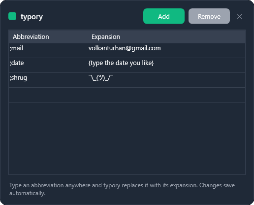
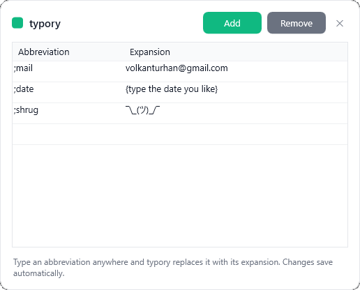

# typory

**[English](README.md) | Türkçe**

Hafif bir Windows metin genişletici.

typory sistem tepsisinde sessizce durur ve sen yazarken kısa kısaltmaları izler.
Birini yazdığın an — örneğin `;mail` — onu silip yerine tam metni yazar
(`volkanturhan@gmail.com`), hangi uygulamada olursan ol. Sürekli yazdığın
metinleri bir kez tanımla, bir daha tam halini yazma.

<p align="center">
  
  
</p>

## Özellikler

- **Her yerde genişlet** — sistem genelinde, her uygulamada, sen yazarken çalışır.
- **Kendi snippet'lerin** — kısaltma → karşılık kurallarını basit bir pencerede yönet.
- **Unicode & sembol** — karşılık her şey olabilir, örn. `;shrug` → `¯\_(ツ)_/¯`.
- **Klavye düzenine duyarlı** — tuşları senin klavye düzeninle çözer; US dışı
  düzenler (örn. Türkçe) ve AltGr karakterleri çalışır.
- **İstediğin an duraklat** — genişletmeyi tepsiden aç/kapa.
- **Yeniden başlatmaya dayanır** — snippet'lerin kaydedilip geri yüklenir.
- **Windows ile başla** — isteğe bağlı, tepsi menüsünden aç/kapa.
- **Kendini günceller** — yeni sürüm çıkınca typory tepsiden teklif eder; tek tıkla kurulur.
- **İngilizce & Türkçe** — arayüz dilini tepsiden değiştir.
- **Karanlık mod** — tepsiden Sistem / Koyu / Açık tema (varsayılan Windows'u takip eder).
- **Tasarımı gereği gizli** — her şey senin makinende kalır, hiçbir şey yüklenmez.

## İndir

En güncel sürümü [**Releases**](https://github.com/volkanturhan/typory/releases/latest) sayfasından indir:

- **typory-setup-…exe** — kurulum (önerilen). Yönetici izni gerekmez ve typory bundan sonra kendini güncel tutar.
- **typory-…exe** — taşınabilir tek dosya; çalıştır yeter, kurulum yok.

İkisi de self-contained, yani .NET kurulu olması gerekmez. Windows 10/11, 64-bit.

typory sessizce sistem tepsisinde başlar — **hiçbir pencere açılmaz**. Bu
normaldir; snippet'lerini ayarlamak için tepsi ikonuna çift tıkla (ya da
**Snippet'leri yönet**'i kullan).

## Kaynaktan çalıştır

Kendin derlemeyi mi tercih edersin? Windows'ta [.NET 8 SDK](https://dotnet.microsoft.com/download/dotnet/8.0)
(sadece runtime değil, SDK) kurulu olmalı.

```bash
git clone https://github.com/volkanturhan/typory.git
cd typory
dotnet run --project typory/typory.csproj
```

## Nasıl kullanılır

1. typory'i başlat — sessizce sistem tepsisine yerleşir.
2. Yöneticiyi açmak için tepsi ikonuna çift tıkla (ya da sağ tık →
   **Snippet'leri yönet**). Birkaç örnek snippet ile başlar.
3. Satır ekle: bir **kısaltma** (örn. `;adres`) ve **karşılığı** (adresin).
   Değişiklikler otomatik kaydedilir — Kaydet düğmesi yok.
4. Artık kısaltmayı herhangi bir uygulamada yaz; typory anında değiştirir.

İpucu: kısaltmaları yanlışlıkla yazmayacağın bir karakterle başlat (`;` ya da `:`
gibi) ki yalnızca isteyince tetiklensinler.

Tepsi ikonuna sağ tık: **Snippet'leri yönet**, **Genişletme açık** (duraklat /
sürdür), **Windows ile başlat**, dil, **Tema** (Sistem / Koyu / Açık),
**Güncellemeleri denetle** ve **Çıkış**.

## Verilerin nerede tutulur

Snippet'lerin yerel olarak `%APPDATA%\typory\snippets.json` içinde saklanır ve
makinenden asla çıkmaz; tercihlerin yanındaki `settings.json` dosyasında tutulur.

## Kendin derle

Yayın dosyalarını yerelde üretmek ister misin? Çıktı repoya dahil edilmez:

```bash
# Taşınabilir self-contained exe + Windows kurulumu, dist/release içine.
# (Kurulum adımı Inno Setup ister: winget install JRSoftware.InnoSetup)
pwsh tools/release.ps1
```

## Teknoloji

- C# / WPF, .NET 8 (Windows)
- Üçüncü parti bağımlılık yok

## Lisans

MIT — bkz. [LICENSE](LICENSE).
